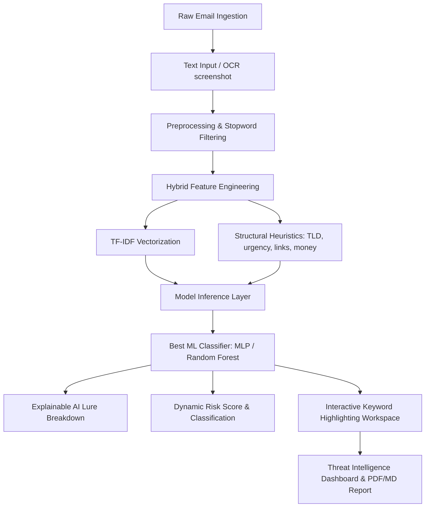

# 🛡️ AI CyberShield: Enterprise Phishing Threat Intelligence & Hybrid ML Platform

[](https://ai-driven-phishing-email-project-sarabjeetsingh2448060.streamlit.app/)
[](https://www.python.org/)
[](https://streamlit.io/)
[](https://scikit-learn.org/)
[](LICENSE)

An end-to-end, enterprise-grade cybersecurity threat intelligence platform powered by Hybrid Machine Learning. It implements a multi-model analysis approach, combining deep semantic NLP features (TF-IDF) with structural heuristics, raw email routing header analysis, and URL reputation checks to defend against advanced email-based threats.

🚀 **Access the Live Portal:** [ai-driven-phishing-email-project-sarabjeetsingh2448060.streamlit.app](https://ai-driven-phishing-email-project-sarabjeetsingh2448060.streamlit.app/)

---

## 🚀 Architecture Diagram



---

## 💼 Resume-Ready Highlights
For your CV, LinkedIn, or portfolio site:
> **Built an AI-powered phishing email detection platform using NLP, TF-IDF, hybrid feature engineering, OCR-based image text extraction, and multiple machine learning models (MLP, Logistic Regression, Random Forest, Naive Bayes), achieving 95.6% accuracy with AUC up to 0.996. Integrated Explainable AI (XAI) risk breakdowns, raw SMTP email header parsers (SPF/DKIM/DMARC), URL reputation checkers, and interactive keyword highlighting to deliver an enterprise-grade cybersecurity dashboard.**

---

## 🌟 Key Features

1. **✨ Advanced Hybrid ML Scanner**: Analyzes text payloads using TF-IDF (4000 features) combined with structural heuristics (URL count, urgency keywords, suspicious TLDs, MFA lures, financial markers).
2. **📸 OCR Character Ingestion**: Users can upload a screenshot of an email (JPEG/PNG). The app decodes character maps using a dual-engine layout (RapidOCR & Pytesseract).
3. **🧠 Explainable AI (XAI)**: Displays an urgency-to-risk indicator break-down including Urgency Language, Suspicious Links, Credential Request, Financial Lures, and Spoofing Indicators.
4. **📊 Real-Time Operations Panel**: A live session statistics hub tracking Scanned Emails, Threats Blocked, Safe Emails, and Average Risk Score.
5. **🛡️ Threat Intel Classification**: Categorizes threat vectors into specific types (e.g. Credential Theft, Business Email Compromise, Invoice Scam, Delivery Scam, MFA Bypass) and auto-identifies target brands (Microsoft, PayPal, Chase, Netflix).
6. **📧 Routing Header Analyzer**: Inspects raw SMTP routing records. Performs authentication verification checks (SPF, DKIM, DMARC validation) and flags header mismatches.
7. **🔗 URL Reputation Checker**: Runs static analysis on link patterns to identify unencrypted HTTP protocols, IP address hosts, lookalike brand spoofing, and high-risk TLDs (.xyz, .zip).
8. **🎨 Cyberpunk Dark Theme UX**: A high-end dark hacker interface designed with neon status gradients, holographic cards, terminal-style logs, and styled interactive elements.
9. **📥 Downloadable Threat Report**: Instantly packages findings, metadata parameters, risk indices, and defensive suggestions into a downloadable Markdown/HTML format.
10. **💬 Threat Intelligence Assistant**: A local, offline cybersecurity chatbot responding to queries like *"What is SPF?"* or *"How do I spot spoofed email senders?"*.

---

## 📁 Repository Map

```text
├── Phishing_Email.csv          # Real-world training dataset (~18.6k samples)
├── train_pipeline.py           # Preprocessing, feature extraction, grid search, and training script
├── test_predict.py             # Command-line prediction and inference testing utility
├── app.py                      # Interactive Streamlit frontend dashboard (Upgraded)
├── project_description_report.md# Academic report detailing guidelines, methodology, and lifecycle
├── confusion_matrix.png        # Best classifier's performance validation chart
├── roc_curve_comparison.png    # ROC curves comparing performance metrics across all models
├── best_phishing_model.joblib  # Serialized Multi-Layer Perceptron (MLP) Neural Network checkpoint
├── tfidf_vectorizer.joblib     # Serialized TF-IDF text feature extractor
└── metadata_scaler.joblib      # Serialized MinMaxScaler metadata scaler
```

---

## ⚙️ Quick Start Installation

### 1. Install Dependencies
Ensure Python 3.8+ is installed on your system. Run:
```bash
pip install -r requirements.txt
```
*(Optionally install pytesseract to get additional OCR fallback compatibility).*

### 2. Run the Training Pipeline
Run the following script to load datasets, engineer features, tune hyper-parameters, and generate model weights:
```bash
python train_pipeline.py
```

### 3. Launch the Interactive App
Start the Streamlit portal locally:
```bash
streamlit run app.py
```
Open `http://localhost:8501` to view your enterprise-ready cybersecurity dashboard!

---

## 📈 System Benchmarks

Model classification results compiled across cross-validation tests on **15,000 stratified samples**:

| Model | Accuracy | Phishing Precision | Phishing Recall | F1-Score | ROC-AUC |
| :--- | :--- | :--- | :--- | :--- | :--- |
| **Neural Network (MLP)** | **95.6%** | **95.2%** | **94.4%** | **94.8%** | **0.996** |
| **Random Forest (Tuned)** | 95.1% | 94.8% | 93.9% | 94.3% | 0.993 |
| **Logistic Regression** | 94.2% | 93.1% | 92.8% | 92.9% | 0.985 |
| **Naive Bayes (Multinomial)**| 91.8% | 90.2% | 89.5% | 89.8% | 0.968 |
