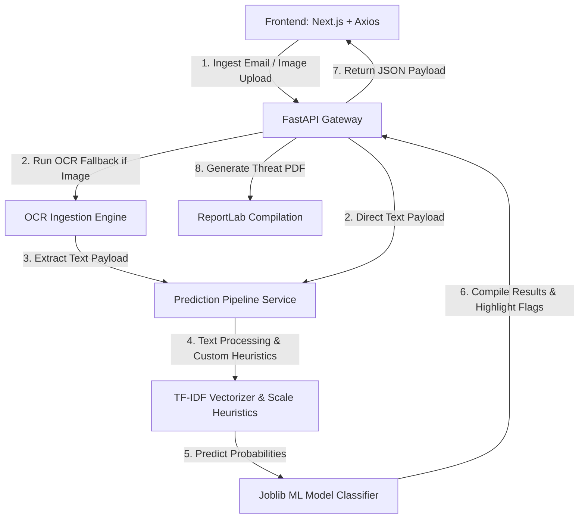

# AI CyberShield - Phishing Threat Intelligence & Detection Platform

AI CyberShield is an enterprise-grade cybersecurity platform that uses Machine Learning (ML) and Natural Language Processing (NLP) models to detect email phishing threats in real-time. 

The application is built on top of a Next.js (TypeScript, TailwindCSS, Framer Motion) premium frontend and powered by a high-performance FastAPI backend encapsulating trained Scikit-Learn classifiers.

* **Live Demo (Streamlit Interface)**: [Streamlit Application Portal](https://ai-driven-phishing-email-project-sarabjeetsingh2448060.streamlit.app/)


## Architecture & Data Flow


```mermaid
graph TD
    A[Frontend: Next.js + Axios] -->|1. Ingest Email / Image Upload| B[FastAPI Gateway]
    B -->|2. Run OCR Fallback if Image| C[OCR Ingestion Engine]
    C -->|3. Extract Text Payload| D[Prediction Pipeline Service]
    B -->|2. Direct Text Payload| D
    D -->|4. Text Processing & Custom Heuristics| E[TF-IDF Vectorizer & Scale Heuristics]
    E -->|5. Predict Probabilities| F[Joblib ML Model Classifier]
    F -->|6. Compile Results & Highlight Flags| B
    B -->|7. Return JSON Payload| A
    B -->|8. Generate Threat PDF| G[ReportLab Compilation]
```

## Tech Stack
* **Frontend**: Next.js 16, TypeScript, TailwindCSS, Framer Motion, Axios, Recharts, Shadcn/ui.
* **Backend**: FastAPI, Uvicorn, Pydantic, Joblib, Scikit-Learn, Pandas, NumPy.
* **OCR Engines**: RapidOCR, Pytesseract, Pillow.
* **Document Compilation**: ReportLab (Dynamic PDF Generation).
* **Containers**: Docker, Docker Compose.

---

## Folder Structure
```text
ai-driven-phishing-email-project/
├── backend/
│   ├── app/
│   │   ├── api/
│   │   │   └── endpoints.py
│   │   ├── models/
│   │   │   └── schemas.py
│   │   └── services/
│   │       ├── pdf_generator.py
│   │       └── prediction_service.py
│   ├── Dockerfile
│   ├── main.py
│   └── requirements.txt
├── ai-phishing-shield/ (Frontend)
│   ├── app/
│   │   ├── dashboard/
│   │   │   ├── analytics/
│   │   │   ├── email-scanner/
│   │   │   ├── models/
│   │   │   ├── reports/
│   │   │   └── results/
│   ├── components/
│   │   ├── cards/
│   │   └── visualization/
│   ├── services/
│   │   └── api.ts
│   ├── Dockerfile
│   ├── package.json
│   └── .env.local
├── best_phishing_model.joblib
├── tfidf_vectorizer.joblib
├── metadata_scaler.joblib
├── docker-compose.yml
└── README.md
```

---

## API Endpoints

### 1. Ingest Raw Email Body Text
* **Route**: `POST /api/analyze-email`
* **Input**:
```json
{
  "email": "Dear PayPal User, please reset your password immediately..."
}
```
* **Response**:
```json
{
  "prediction": "Phishing",
  "confidence": 98.4,
  "risk_score": 96,
  "attack_type": "Credential Harvesting",
  "severity": "Critical",
  "indicators": [
    "Suspicious URL",
    "Urgency Language",
    "Password Request"
  ],
  "highlighted_email": "Dear <mark ...>PayPal</mark> User, please reset your <mark ...>password</mark>...",
  "model": "Random Forest (Tuned)"
}
```

### 2. Ingest Email Screenshot / Image Ingestion
* **Route**: `POST /api/upload-image`
* **Input**: Multipart file upload (`file`).
* **Response**: JSON matching the raw text output.

### 3. Fetch Dashboard Analytics Summary
* **Route**: `GET /api/dashboard`
* **Response**: Returns statistics for scanned counts, threats blocked, safe counts, accuracy, and best model indicators.

### 4. Fetch Trained ML Benchmarks
* **Route**: `GET /api/models`
* **Response**: Comparative arrays for accuracy, recall, precision, ROC-AUC, and production status.

### 5. Fetch Threat PDF Report
* **Route**: `GET /api/report/{id}/download-pdf`
* **Response**: Dynamically generated binary PDF stream matching threat credentials.

---

## Local Installation

### Prerequisites
* Python 3.10+
* Node.js 18+
* Tesseract binary installed (if using Tesseract fallback OCR)

### Launching the Backend
1. Go to the backend directory:
   ```bash
   cd backend
   ```
2. Install Python packages:
   ```bash
   pip install -r requirements.txt
   ```
3. Start the FastAPI uvicorn daemon:
   ```bash
   uvicorn main:app --reload --port 8000
   ```

### Launching the Next.js Frontend
1. Go to the frontend directory:
   ```bash
   cd ../ai-phishing-shield
   ```
2. Install dependencies:
   ```bash
   npm install
   ```
3. Start the development server:
   ```bash
   npm run dev
   ```

4. Access the portal at `http://localhost:3000`.
---

## Docker Deployment

To launch the complete application stack (Next.js + FastAPI) inside Docker containers:

```bash
docker-compose up --build
```
* Frontend portal: `http://localhost:3000`
* Backend API: `http://localhost:8000`

---

## Future Scope
* **Real-time API Scanning**: Add integrations with Microsoft Graph API and Google Workspace API.
* **Continuous Retraining**: Set up pipelines to continuously retrain the ML model dynamically on quarantined threat data.
* **Deep Neural Networks**: Support Transformer-based models (like BERT or custom encoders) for context-based urgency detection.
