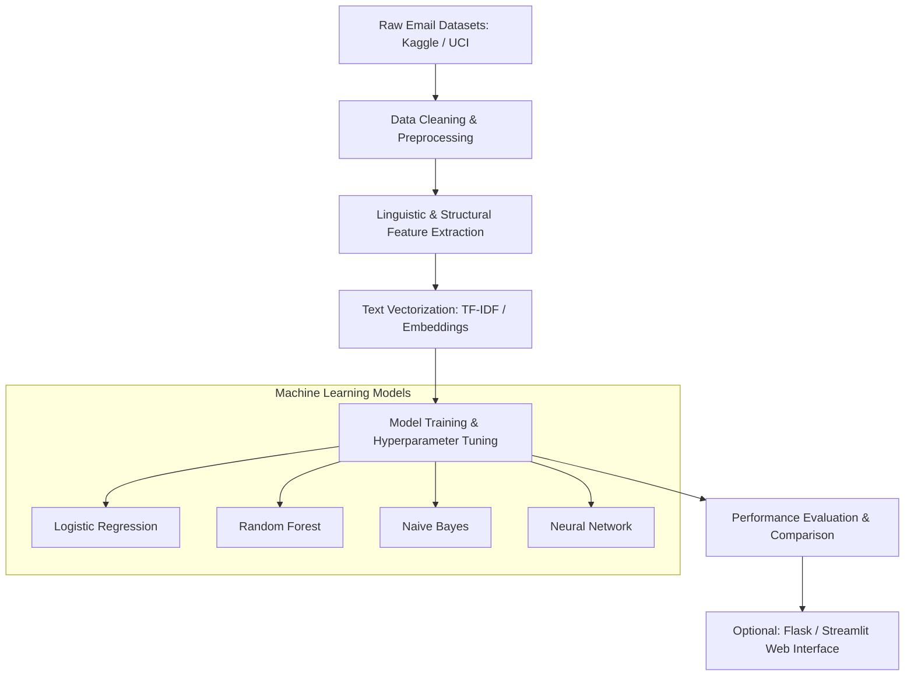

# Project Description Report: AI-Driven Phishing Email Detection Using NLP

**Project Title:** AI-Driven Phishing Email Detection Using NLP (Natural Language Processing)  
**Academic Level:** B.Tech Portfolio Project (Cybersecurity & Data Science)  
**Author:** Academic Portfolio Project Team  
**Date:** July 2026  

---

## 1. Introduction & Objective

### 1.1 Introduction
In the contemporary digital era, email remains a primary medium for professional, financial, and personal communication. However, this ubiquity also makes it the most exploited attack vector for cybercriminals. Phishing is a social engineering attack where malicious actors impersonate legitimate entities to trick individuals into revealing sensitive information, such as login credentials, financial details, or personal identifiable information (PII).

Traditional signature-based and blacklisting detection methods—which rely on identifying known malicious IP addresses, sender domains, or files—are increasingly ineffective against modern, sophisticated phishing campaigns. Attackers frequently bypass these perimeter defenses by utilizing zero-day domains, polymorphic email structures, and highly customized content tailored to specific victims (spear-phishing).

To counter these tactics, Natural Language Processing (NLP) has emerged as a critical capability in modern cybersecurity. NLP enables automated systems to analyze the actual *content* and semantics of email messages. Unlike superficial checks, NLP-driven systems can identify:
*   **Language Tricks:** Deceptive semantic constructions, stylistic anomalies, and syntax manipulation designed to evade simple keyword filters.
*   **Urgency & Emotion Analysis:** Detecting psychological triggers such as artificial urgency ("Act Now!"), fear-inducing warnings ("Your account will be suspended"), or unexpected promises of financial gain.
*   **Suspicious Contextual Patterns:** Mismatches between the claimed sender identity and the writing style, signature formatting, or call-to-action alignment.
*   **Heuristic Discrepancies:** Discrepancies between body text semantics and metadata signals, such as mismatched hyperlinks, unaligned sender addresses, or hidden redirects.

### 1.2 Objective
The core objective of this project is to design, implement, and evaluate an end-to-end Machine Learning system that automatically classifies emails as either "Phishing" or "Legitimate" (Ham). 

Built from scratch, the system will leverage a hybrid analysis approach combining **text-based natural language processing features** and **structural metadata features**. Key operational milestones include:
1.  Establishing a robust text preprocessing pipeline to clean raw, unstructured email bodies.
2.  Extracting discriminative linguistic, statistical, and structural features.
3.  Training, optimizing, and performing a comparative evaluation of four distinct machine learning classifiers.
4.  Validating model performance using standard evaluation metrics to ensure high detection accuracy and a low false-positive rate (critical for maintaining user trust in email communication).

---

## 2. Project Scope

This project encompasses the full lifecycle of data-driven cybersecurity engineering, starting from raw data ingestion and ending with model evaluation and an optional deployment prototype.



### 2.1 Data Collection & Ingestion
The scope is bounded by the utilization of publicly available, standard email corpus repositories (e.g., Kaggle's Phishing Email Dataset, UCI Machine Learning Repository's Spambase, or the Enron Spam/Ham datasets). The combined dataset will incorporate a balanced representation of both legitimate business/personal communications and diverse phishing emails (spanning credential harvesting, malware delivery, and financial scams).

### 2.2 Feature Extraction Boundaries
The system will analyze two primary dimensions of email data:
*   **Linguistic Features:** Word patterns, vocabulary distribution, TF-IDF vector representations of the text, and presence of trigger keywords (e.g., "verify", "secure", "bank", "update", "millions").
*   **Structural & Metadata Features:** Presence and quantity of hyperlinks, discrepancies between display text and destination URLs, sender domain anomalies, presence of attachments, and email formatting clues (such as HTML vs. plain text).

### 2.3 Model Training & Optimization
The project details the implementation and optimization of four distinct models:
*   **Logistic Regression:** Serving as a strong linear baseline.
*   **Random Forest:** An ensemble method to capture non-linear relationships and feature interactions.
*   **Naive Bayes (Multinomial/Bernoulli):** A probabilistic classifier historically well-suited for high-dimensional text classification.
*   **Simple Artificial Neural Network (ANN):** A multi-layer perceptron architecture built to explore non-linear deep feature representations.

### 2.4 Performance Benchmarking
Evaluation is conducted quantitatively using a test split. Performance metrics will include:
*   **Accuracy:** Overall correctness of the model.
*   **Precision:** The ratio of true positives to all predicted positives (critical to minimize flagging legitimate emails as phishing).
*   **Recall (Sensitivity):** The ratio of true positives to all actual phishing emails (critical to prevent phishing emails from slipping into the inbox).
*   **F1-Score:** The harmonic mean of precision and recall.
*   **Confusion Matrix Analysis:** Visual representation of True Positives, False Positives, True Negatives, and False Negatives.
*   **Feature Importance Analysis:** Interrogating the models (e.g., Random Forest) to understand which words or structural cues are the strongest indicators of phishing.

---

## 3. Methodology & Lifecycle Phases

The project will follow a structured, iterative machine learning lifecycle consisting of five primary phases.

```mermaid
chronology
    title Project Lifecycle Phases
    Data Collection & Exploration : Stage 1
    Data Cleaning & Preprocessing : Stage 2
    Feature Engineering & Vectorization : Stage 3
    Model Development & Hyperparameter Tuning : Stage 4
    Evaluation & Interface Deployment : Stage 5
```

### Phase 1: Data Collection & Exploratory Data Analysis (EDA)
*   **Data Aggregation:** Consolidating raw datasets into a unified tabular format containing at least two columns: `email_text` (unstructured string) and `label` (binary indicator: 1 for Phishing, 0 for Legitimate).
*   **Exploratory Data Analysis (EDA):** Analysing label distributions (checking for class imbalance), calculating text lengths, visualizing word clouds for phishing vs. ham classes, and analyzing correlation structures between metadata features.

### Phase 2: Data Cleaning & Preprocessing
Raw emails contain significant noise that can degrade model performance. The pipeline includes:
*   **HTML Tag Removal:** Using regular expressions or parsing libraries to strip out HTML tags (`<p>`, `<a>`, `<div>`) and extract raw text.
*   **Normalisation:** Converting all text to lowercase to ensure consistency (e.g., "URGENT" and "urgent" map to the same token).
*   **Punctuation & Special Character Removal:** Filtering out non-alphanumeric characters, while selectively retaining indicators like exclamation marks (`!`) and currency symbols (`$`, `£`) as they often signal urgency or financial lures.
*   **Stopword Elimination:** Removing common words (e.g., "is", "the", "and", "in") that carry minimal semantic value for classification.
*   **Tokenization & Lemmatization/Stemming:** Splitting sentences into individual words (tokens) and reducing words to their dictionary root form (lemmatization) or base stem (stemming) to collapse grammatical variations (e.g., "running", "runs", "ran" to "run").

### Phase 3: Feature Engineering & Representation
To feed email text into machine learning algorithms, it must be converted into numerical vectors:
*   **TF-IDF (Term Frequency-Inverse Document Frequency):** Transforming text tokens into numerical vectors that weigh words based on their frequency in a specific email versus their frequency across the entire corpus. This highlights unique, highly indicative words.
*   **Metadata & Structural Feature Extraction:** Extracting engineered features using regular expressions:
    *   `has_url` (binary: presence of URLs)
    *   `url_count` (integer: total URLs in the body)
    *   `has_ip_as_url` (binary: URL containing an IP address instead of a domain name)
    *   `has_urgency_words` (binary: presence of terms like "urgent", "immediate action", "verify now")
*   **Feature Fusion:** Concatenating the sparse TF-IDF text matrix with the dense structural metadata feature matrix to create a unified input vector for the models.

### Phase 4: Model Development & Hyperparameter Tuning
*   **Data Split:** Dividing the engineered dataset into training (e.g., 80%) and validation/testing (e.g., 20%) splits using stratified sampling to preserve class ratios.
*   **Training Pipeline:** Constructing pipelines for the four target architectures:
    *   **Logistic Regression:** Optimizing solver algorithms and L1/L2 regularization strengths ($C$ parameter).
    *   **Naive Bayes:** Applying Multinomial Naive Bayes with Laplace smoothing adjustments.
    *   **Random Forest:** Tuning hyperparameters including the number of estimators (trees), maximum depth, and minimum samples per leaf.
    *   **Neural Network (MLP):** Building a feed-forward architecture with an input layer matching the feature dimensions, hidden layers with ReLU activation and Dropout regularization, and a single-node output layer with a Sigmoid activation function.
*   **Optimization:** Using grid search or random search cross-validation to isolate optimal parameters.

### Phase 5: Evaluation & Interface Deployment
*   **Quantitative Benchmarking:** Executing evaluation runs on the test split, generating classification reports, and plotting confusion matrices.
*   **Feature Importance Verification:** Extracting weight coefficients (Logistic Regression) or gini importance scores (Random Forest) to document the top semantic indicators of phishing.
*   **Optional Web Interface Deployment:** Constructing a lightweight, interactive web application using Flask or Streamlit. The application allows users to paste raw email text into a text area, parses the inputs through the saved preprocessing pipeline, applies the best-performing model, and returns a dynamic prediction (e.g., "Warning: Phishing Detected with 94.5% Confidence" in red, or "Safe: Legitimate Email" in green).

---

## 4. Technical Stack & Tools

The implementation utilizes an industrial-standard Python-centric technical stack suitable for scientific computing, natural language processing, and machine learning.

| Component | Technology / Library | Role & Function |
| :--- | :--- | :--- |
| **Development Environment** | Jupyter Notebook / Google Colab | Iterative prototyping, inline visualization, step-by-step document development, and code execution blocks. |
| **Data Manipulation** | `pandas` | Ingesting csv/json datasets, data cleaning, exploratory data analysis, filtering, and structured table manipulation. |
| **Numeric Operations** | `numpy` | High-performance matrix operations, mathematical transformations, and array restructuring. |
| **Natural Language Processing** | `NLTK` / `spaCy` | Providing tokenizers, stopword lists, lemmatizers, and advanced POS (Part-Of-Speech) taggers. |
| **Machine Learning** | `scikit-learn` | Implementing TF-IDF Vectorization, dataset splitting (`train_test_split`), training (Logistic Regression, Naive Bayes, Random Forest), hyperparameter tuning (`GridSearchCV`), and metrics calculation. |
| **Deep Learning** | `TensorFlow` / `Keras` (or `PyTorch`) | Building, compiling, training, and saving the Multi-Layer Perceptron neural network. |
| **Data Visualization** | `matplotlib` / `seaborn` | Plotting training history curves, validation curves, confusion matrices, and feature importance bar graphs. |
| **Serialization** | `joblib` / `pickle` | Saving trained models and vectorizers to disk for web-app integration. |
| **Deployment (Optional)** | `Streamlit` / `Flask` | Creating an interactive graphical user interface to test live email samples. |

---

## 5. Expected Deliverables & Outcomes

### 5.1 Project Deliverables
At the conclusion of the development cycle, the project will yield the following artifacts:
1.  **Fully Documented Python Jupyter Notebook:** A single, clean notebook containing the pipeline from data ingestion to model deployment, structured with markdown annotations, inline graphs, and comments.
2.  **Dataset Repository:** The raw datasets alongside the finalized, cleaned, and processed dataset files (CSV/Parquet format).
3.  **Comparative Analysis & Evaluation Report:** A comprehensive documentation of all experimental runs, detailing hyperparameter choices, performance metric comparison tables, and visual representation of confusion matrices.
4.  **Presentation Slides:** Technical slides designed to explain the project problem statement, pipeline architecture, evaluation results, and security conclusions to both academic and business audiences.
5.  **Interactive Web Dashboard (Optional):** A working Streamlit or Flask codebase that runs locally or is hosted on a cloud platform (e.g., Hugging Face Spaces, Render) for live threat assessment.

### 5.2 Educational & Learning Outcomes
By completing this portfolio project, developers will gain competencies in:
*   **Advanced Text Classification Pipelines:** Designing end-to-end pipelines that transform raw natural language strings into high-dimensional numerical feature spaces.
*   **Digital Threat Intel & Cybersecurity:** Understanding how social engineering attacks manifest linguistically and how heuristics can be modeled to automate threat defense mechanisms.
*   **Model Optimization & Evaluation:** Learning how to handle imbalanced datasets (e.g., using class weights or synthetic sampling) and select models based on custom precision-recall trade-offs specific to cybersecurity scenarios.
*   **Ethical AI & Explainability:** Applying feature importance analysis to audit and explain ML model decisions, ensuring AI transparency and alignment with trustworthy AI guidelines.
